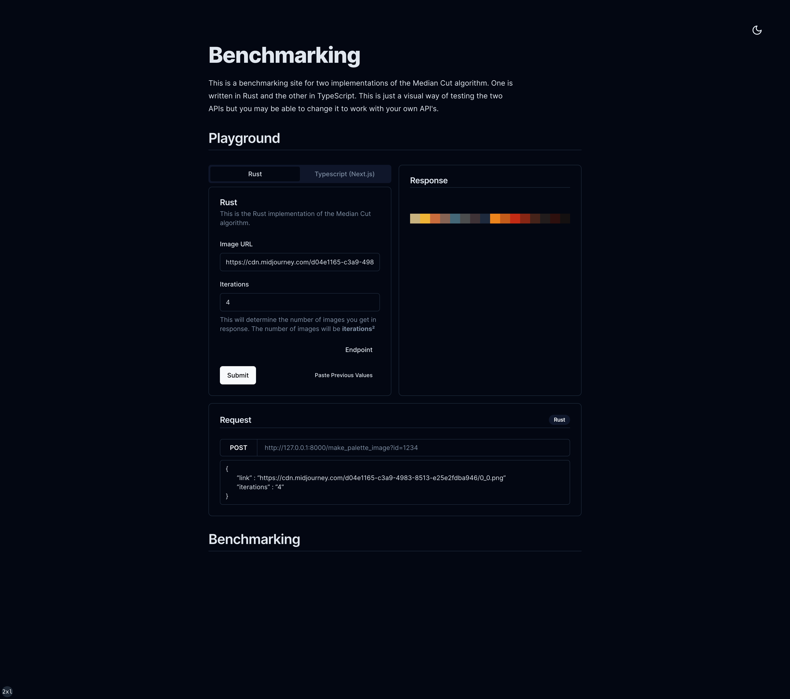
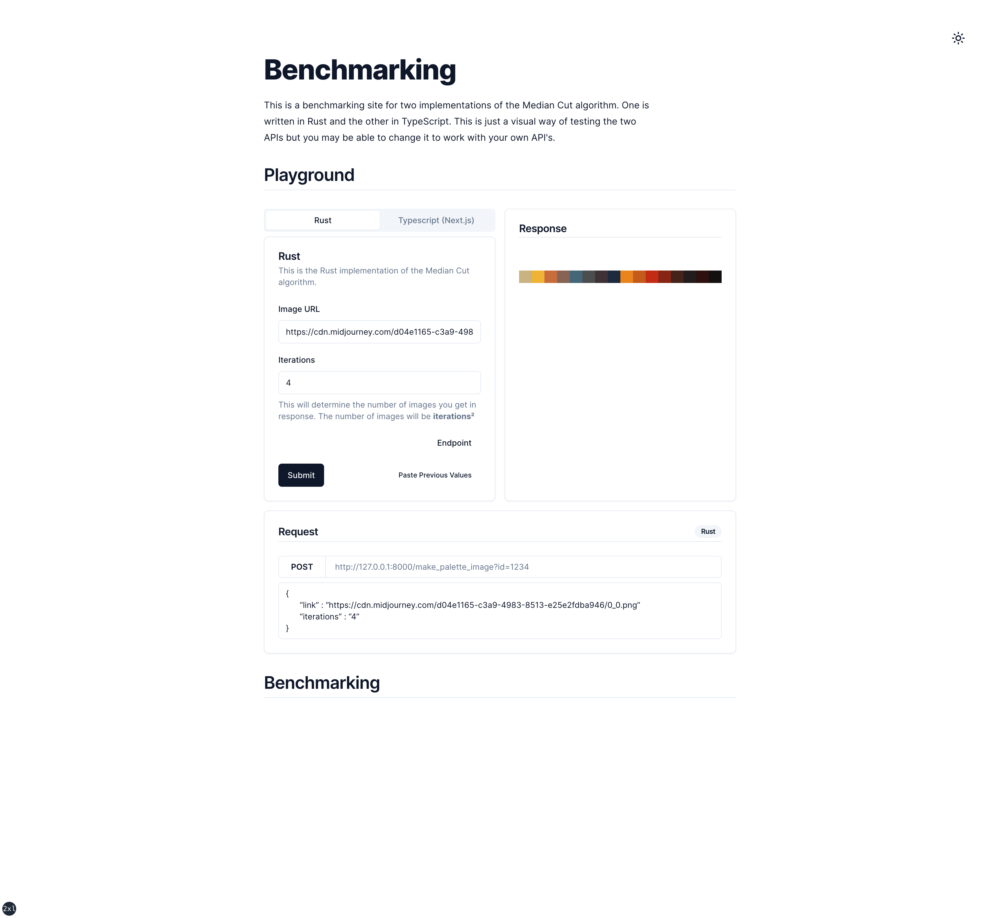

# Rust & TypeScript Median Cut Benchmarking

This repository contains a Next.js, TypeScript, and TailwindCSS project that provides a web interface for benchmarking two APIs, both of which take a URL and output an image palette. These APIs implement the Median Cut algorithm; one is written in Rust and the other in TypeScript.

## Overview

The web interface allows users to submit an image URL to either of the two APIs and view the generated image palette. The main goal is to visually compare the performance and output of these two implementations.

## Getting Started

To get started, clone the repository and install the dependencies:

    git clone https://github.com/bendigiorgio/ts-median-cut-rust-comparison.git
    cd ts-median-cut-rust-comparison
    yarn

Run the development server:

    yarn dev

Open [http://localhost:3000](http://localhost:3000) with your browser to see the result.

You will also require the Rust API to be running locally. See the [Rust API repository](https://github.com/bendigiorgio/image-to-palette-rust)
This can be run with the command:

    cargo run

Cors is enabled for localhost:3000 in the Rust API.

## Preview

## Interesting Components

### `input.tsx`

- This is an input component based on radix-ui.
- The password variant includes a show/hide password button.
- The **_dropzone_** prop allows the component to be used as a dropzone for files.

## Contributing

As this project is in progress, contributions are welcome. Please open an issue or submit a PR if you would like to contribute.
